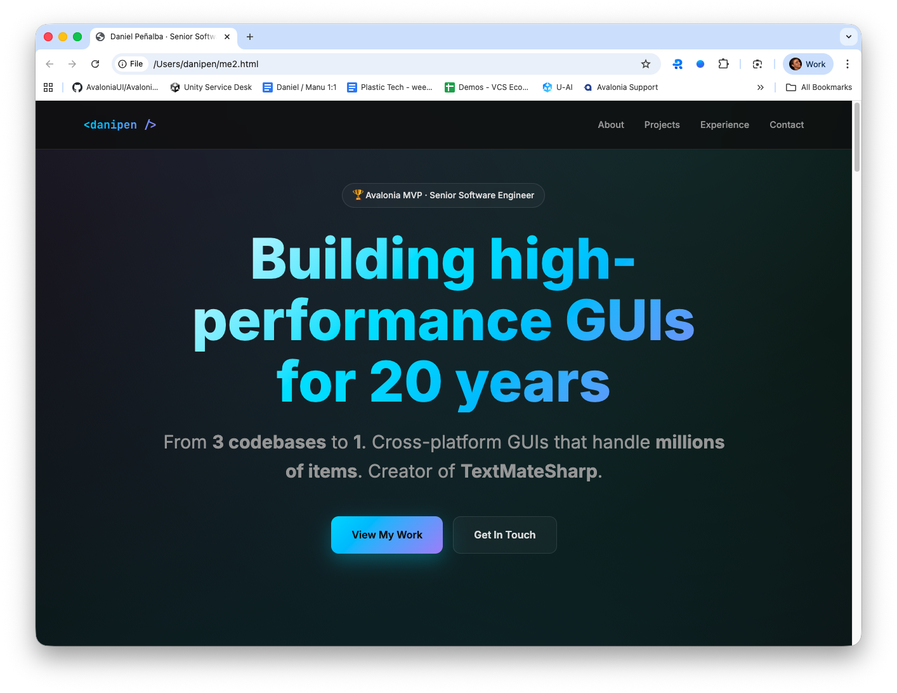

# Daniel Peñalba - Personal Portfolio

[](https://danipen.github.io)
[](LICENSE)

> Building high-performance GUIs for 20 years | Senior Software Engineer @ Unity Technologies | Avalonia MVP



## 🎯 About

This is my personal portfolio website showcasing my work as a Senior Software Engineer specializing in GUI architecture, performance optimization, and version control systems.

**Highlights:**
- 20 years building Version Control Systems
- Avalonia MVP
- 525K+ downloads on open source projects
- #1 contributor to AvaloniaEdit
- Creator of TextMateSharp

## ✨ Features

- **Performance-first design** - Optimized animations and lazy loading
- **Glassmorphism UI** - Modern, elegant design with backdrop blur effects
- **Animated metrics** - Numbers count up on scroll
- **Smooth parallax** - Subtle motion for depth
- **Fully responsive** - Mobile, tablet, and desktop optimized
- **Zero dependencies** - Pure HTML, CSS, and vanilla JavaScript
- **Lightning fast** - Single file, no build process required

## 🚀 Quick Start

### View Live
Visit [danipen.github.io](https://danipen.github.io)

### Run Locally
```bash
# Clone the repository
git clone https://github.com/danipen/danipen.github.io.git

# Open in browser
open index.html

# Or serve with Python
python3 -m http.server 8000
# Then visit http://localhost:8000
